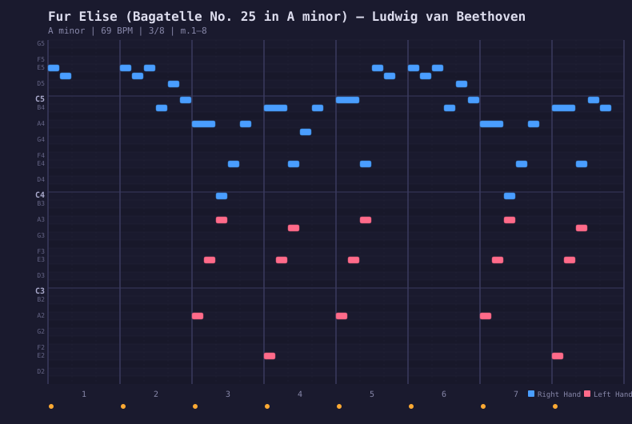
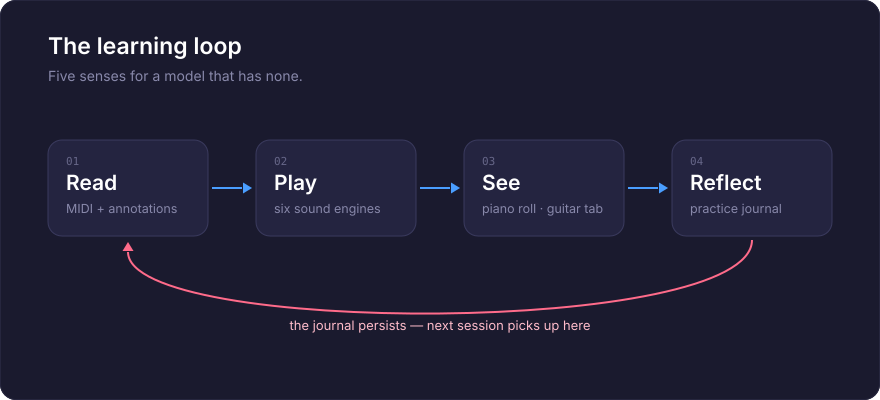

<p align="center">
  <a href="README.ja.md">日本語</a> | <a href="README.zh.md">中文</a> | <a href="README.es.md">Español</a> | <a href="README.md">English</a> | <a href="README.hi.md">हिन्दी</a> | <a href="README.it.md">Italiano</a> | <a href="README.pt-BR.md">Português (BR)</a>
</p>

<p align="center">
  
</p>

<p align="center">
  <em>Machine Learning the Old Fashioned Way</em>
</p>

<p align="center">
  An MCP server that teaches AI to play piano and guitar — and sing.<br/>
  120 songs across 12 genres. Six sound engines. Interactive guitar tablature.<br/>
  A browser cockpit with vocal synthesizer. A practice journal that remembers everything.
</p>

<p align="center">
  <a href="https://github.com/mcp-tool-shop-org/ai-jam-sessions/actions/workflows/ci.yml"></a>
  <a href="https://www.npmjs.com/package/@mcptoolshop/ai-jam-sessions"></a>
  <a href="https://github.com/mcp-tool-shop-org/ai-jam-sessions"></a>
  <a href="https://github.com/mcp-tool-shop-org/ai-jam-sessions"></a>
  <a href="datasets/jam-actions-v0-public/README.md"></a>
  <a href="https://doi.org/10.5281/zenodo.20279918"></a>
</p>

---

## Qu'est-ce que c'est ?

Un piano et une guitare qu'une IA apprend à jouer. Pas un synthétiseur, pas une bibliothèque MIDI, mais un instrument pédagogique.

Un LLM peut lire et écrire du texte, mais il ne peut pas apprécier la musique comme nous le faisons. Il n'a ni d'oreilles, ni de doigts, ni de mémoire musculaire. AI Jam Sessions comble cette lacune en donnant au modèle des sens qu'il peut réellement utiliser :

- **Lecture** — partition MIDI réelle avec des annotations musicales approfondies. Pas d’approximations manuscrites, mais des données analysées, interprétées et expliquées.
- **Audition** — six moteurs audio (piano oscillateur, piano échantillonné, échantillons vocaux, tractus vocal physique, synthétiseur vocal additif, guitare modélisée physiquement) qui diffusent le son via vos haut-parleurs, transformant ainsi les personnes présentes dans la pièce en les « oreilles » de l’IA. Et maintenant, le modèle a ses propres oreilles : il peut mesurer un enregistrement qu’il a réalisé, ou un que vous avez réalisé, et indiquer ce qu’il contient réellement — voir [Écoute](#écoute).
- **Visualisation** — un piano-rouleau qui affiche ce qui a été joué sous forme de SVG, que le modèle peut relire et vérifier. Un éditeur interactif de tablatures de guitare. Un cockpit de navigateur avec un clavier visuel, un éditeur de notes à deux modes et un laboratoire d’accordage.
- **Mémorisation** — un journal de pratique qui est conservé entre les sessions, afin que l’apprentissage s’accumule avec le temps.
- **Chant** — synthèse du tractus vocal avec 20 préréglages vocaux, allant du soprano d’opéra au chœur électronique. Mode « chant en chœur » avec solfège, contour et narration syllabique. Et une véritable ligne mélodique chantée sur le tempo du piano : un chanteur conditionné par la partition, piloté par le MIDI de la chanson, avec une porte temporelle (40 ms) et une porte de hauteur (50 cents) avant que vous ne l’entendiez — voir [Chant](#chant).

Chacune des 120 chansons est désormais entièrement annotée : contexte historique, analyse structurelle mesure par mesure, moments clés, objectifs pédagogiques et conseils de performance, dans les 12 genres. Une version antérieure de ce fichier README indiquait que les chansons brutes « attendaient que l'IA assimile les motifs, joue la musique et rédige ses propres annotations ». C'est exactement ce qui s'est passé : les annotations ont été rédigées par l'IA sur la base d'une analyse déterministe de chaque chanson (accords, structure répétitive, limites des sections, tonalités vérifiées), soumises à une grille d'évaluation de la qualité et vérifiées de manière contradictoire affirmation par affirmation : numéros de mesures, fenêtres d'accords et décomptes structurels sont tous vérifiés par rapport au MIDI réel avant que quoi que ce soit ne soit publié.

Dans le cadre de ce même travail, nous publions également **[jam-actions-v0](#training-dataset)** : un ensemble de données public de 115 séquences d'utilisation d'outils MCP en plusieurs étapes sur du piano classique réel. Il enseigne aux LLM à effectuer une *utilisation d'outils ancrée dans la musique symbolique*, et pas seulement la génération de texte, et est livré avec une grille de publication à 7 axes qui distingue le fait de « transmettre des preuves » du fait de « passer parce que la tâche est triviale ». Voir [Ensemble de données d'entraînement](#training-dataset) ci-dessous pour l'histoire complète.

## Écoute

Pendant longtemps, ce serveur pouvait produire du son, mais ne pouvait pas l’analyser. Le modèle jouait, un humain écoutait, et le modèle se basait sur son avis. Cette lacune est désormais comblée.

Si vous le pointez vers un fichier WAV, il mesure ce qu’il contient. Pas en regardant une image et en devinant, mais en faisant passer le signal à travers les mêmes types d’outils qu’il utilise déjà pour la partition :

- **`analyze_audio`** — débuts, contour de la hauteur et niveau. La hauteur est renvoyée sous forme de noms de notes avec des déviations en cents, jamais sous forme de fréquences brutes.
- **`transcribe_audio`** — l’enregistrement sous forme de notes : hauteur, début, durée et écart de chaque note par rapport à la hauteur de référence.
- **`score_audio_take`** — évaluation d’une performance par rapport à une chanson de la bibliothèque, à l’oreille. Il transcrit l’enregistrement, le compare à la partition et indique quelles notes ont été jouées correctement, lesquelles ont dévié et lesquelles ont été manquées. Ensuite, `view_scored_piano_roll` affiche le résultat sur la partition, exactement comme il le fait pour un enregistrement MIDI. C’est ainsi que vous évaluez un instrument réel, un enregistrement vocal ou tout autre élément pour lequel il n’y a pas de MIDI à enregistrer.
- **`view_spectrogram`** — visualisez le son. Un spectrogramme à Q constant avec un clavier de piano sur le bord gauche, de sorte que la hauteur soit lisible en un coup d’œil, et que les notes prévues de la chanson soient affichées dessus, sur demande.

**Ce que cela ne vous dira pas.** L’image sert à déterminer *où* se trouve le problème ; chaque nombre provient du traitement du signal, et non d’un modèle qui lit une image. Le transcripteur suit une ligne à la fois, de sorte qu’un accord ou un mixage complet produira quelque chose de convaincant, mais incorrect, et il l’indiquera. La détection des débuts atteint environ 0,88 F1 à l’état de l’art, de sorte qu’une note « manquée » peut être une note que le transcripteur n’a pas pu entendre, plutôt qu’une note que vous n’avez pas jouée — les outils incluent cette réserve dans leurs propres résultats, plutôt que de la masquer ici.

L’ensemble de la surface est indépendant : la transformation, le suivi de la hauteur, le détecteur de débuts, le décodeur WAV et l’encodeur PNG sont tous inclus dans ce dépôt, et ils produisent des nombres identiques dans Node et dans le navigateur.

## L’ensemble en direct

L’analyse d’un enregistrement se fait une fois celui-ci terminé. Voici l’autre aspect : déterminer ce que chaque instrument joue **en ce moment même**, pendant l’exécution.

```
ensemble_now()
```

Le système répond en indiquant les notes tenues par chaque instrument, la durée pendant laquelle elles ont été tenues, et l’accord combiné de l’ensemble. Pendant un duo, les deux voix sont rapportées séparément, ce qui permet de voir le piano jouer un accord de trois notes tandis que le synthétiseur joue la mélodie par-dessus.

### Deux canaux, et le moins cher est le plus précis

C’est l’aspect important à comprendre, car il détermine quel chiffre il faut prendre en compte.

**Intention : ce que chaque moteur a été programmé pour jouer.** Lorsque le modèle est celui qui joue, il ne s’agit pas d’une estimation. Un accord de piano n’est pas quelque chose à transcrire ; il s’agit de trois notes qui ont été envoyées. Les notes sont exactes, libres et immédiates.

**Acoustique : ce qui est réellement produit.** Chaque moteur peut diriger sa sortie vers un bus d’analyse privé, de sorte que chaque instrument est mesuré à la source, sans séparation ni ambiguïté. Ce canal est une **vérification, et non une découverte** : il permet de savoir si une voix s’est décalée, si un enregistrement a été coupé ou si un moteur s’est arrêté alors qu’il continuait à recevoir des notes.

Lorsque les deux informations divergent, il s’agit d’un fait concernant le rendu, et non d’une correction des notes.

### Coût

L’analyse d’un instrument coûte environ **9 microsecondes par appel audio**, par rapport à un bloc de 42,67 ms, ce qui représente environ 0,02 % du budget audio, mesuré avec zéro échantillon perdu. Un instrument sans observateur attaché ne coûte absolument rien.

### Ce que cela ne vous dira pas

Le canal acoustique présente un décalage et indique l’ampleur de ce décalage : environ 23 ms pour la hauteur et 70 ms pour le début confirmé, car un début ne peut être confirmé que lorsque l’audio qui le suit est reçu. Les débuts proches de cette limite sont omis plutôt que rapportés, puis supprimés ultérieurement.

Le suivi acoustique suit une ligne à la fois, il ne pourra donc pas identifier les notes d’un accord, et il ne prétend pas le faire. Un accord qu’il ne peut pas résoudre est sa limite connue, plutôt qu’une découverte, et l’ensemble reste silencieux à ce sujet au lieu de crier au loup à chaque accord joué par le piano.

## Le clavier de piano

Le clavier de piano est le moyen par lequel l'IA perçoit la musique. Il affiche chaque chanson sous forme de SVG : bleu pour la main droite, corail pour la main gauche, avec des grilles rythmiques, des nuances et des limites de mesures :

<p align="center">
  
</p>

<p align="center"><em>Für Elise, measures 1–8 — the E5-D#5 trill in blue, bass accompaniment in coral</em></p>

Deux modes de couleur : **main** (bleu/corail) ou **classe chromatique** (arc-en-ciel chromatique : chaque Do est rouge, chaque Fa# est cyan). Le format SVG signifie que le modèle peut à la fois voir l'image et lire le balisage pour vérifier la hauteur, le rythme et l'indépendance des mains.

## L'interface

Un studio de composition basé sur un navigateur qui se trouve dans ce dépôt à l'adresse [`apps/cockpit`](apps/cockpit) et fonctionne en direct à l'adresse **[mcp-tool-shop-org.github.io/ai-jam-sessions/cockpit](https://mcp-tool-shop-org.github.io/ai-jam-sessions/cockpit/)**. Pas de plugins, pas de DAW, pas d'installation ; tout reste dans votre navigateur (votre travail est automatiquement enregistré localement). Préférez-vous le modifier ?

```bash
cd apps/cockpit && npm install && npm run dev   # Vite dev server, opens in your browser
```

- **Par défaut, un piano de concert échantillonné** — le panneau principal intègre une version allégée du pack Salamander Grand (90 fichiers OGG, 8 Mo) qui se charge lors de votre première interaction et utilise la même chaîne de traitement que les voix synthétiques ; avant son chargement (ou hors ligne), les pianos à oscillateurs accordés assurent une transition fluide. Échantillons par [Alexander Holm](https://freepats.zenvoid.org/Piano/acoustic-grand-piano.html), CC-BY 3.0.
- **Mode panneau — la salle d’écoute** — tests comparatifs aveugles en série des sonorités du moteur de composition sur des mélodies réelles issues de la bibliothèque : extraits appariés en termes de volume, rendus hors ligne via le chemin audio réel, essais aléatoires avec des pièges cachés pour évaluer les limites de discrimination, classements Bradley-Terry avec intervalles de confiance bootstrap, et résultats honnêtes (PROVISOIRES jusqu’à ce que chaque paire atteigne son quota de votes ; NON INTERPRÉTABLES lorsque la limite de discrimination est atteinte). Un deuxième sous-mode exécute le même classement avec des juges LLM locaux, ainsi qu’un historique pour les deux types d’exécution et une vue comparative (Kendall τ + correspondance du classement du moteur) qui permet de déterminer si les pistes simplifiées reflètent fidèlement la réalité.
- **Synchronisation précise** — les notes sont synchronisées avec le tempo musical, ce qui signifie que le contrôle du BPM ajuste réellement le rythme de lecture ; une règle temporelle avec clic pour naviguer et des régions de boucle définissables par glisser-déposer ; défilement automatique qui suit la tête de lecture.
- **Enregistrement activé** — jouez sur les touches QWERTY, le clavier à l’écran ou un appareil Web MIDI, et cela sera enregistré dans la partition : une mesure d’introduction, un enregistrement en boucle comme avec un looper (ou remplacement), le timing brut de l’interprétation est préservé sous une vue quantifiée, chaque passage constitue une unité unique pouvant être annulée.
- **Annulation/rétablissement complet** — toutes les modifications, y compris Effacer et Importer, sont réversibles (Ctrl+Z), avec des gestes de glisser qui se combinent comme le font les éditeurs classiques.
- **Sélection multiple + presse-papiers** — sélection par rectangle sous un outil de sélection/dessin à bascule, clics modificateurs standard de la plateforme, copier/couper/coller au niveau de la tête de lecture, Dupliquer.
- **Tactile et accessibilité** — événements du pointeur avec capture sur chaque surface, tapoter pour redéfinir la position comme alternative au glissement, édition des notes au clavier, superposition de partitions adaptée aux personnes daltoniennes.
- **Piano roll à double mode** — basculez entre le mode Instrument (couleurs par classe chromatique) et le mode Vocal (notes colorées en fonction de la forme vocalique : /a/ /e/ /i/ /o/ /u/).
- **Clavier visuel** — deux octaves à partir de C4, mappé sur votre clavier QWERTY. Cliquez ou tapez.
- **20 préréglages vocaux** — 15 voix mappées Kokoro (Aoede, Heart, Jessica, Sky, Eric, Fenrir, Liam, Onyx, Alice, Emma, Isabella, George, Lewis, plus chœur et voix synthétiques), 4 voix mappées sur le spectre sonore et une section de chœur synthétique.
- **10 préréglages d’instruments** — les 6 voix de piano côté serveur, plus un pad synthétique, un orgue, une cloche et des cordes.
- **Inspecteur de notes** — cliquez sur n’importe quelle note pour modifier la vélocité, la voyelle et l’intensité.
- **7 systèmes d’accordage** — tempérament égal, intonation juste (majeur/mineur), pythagoricien, gamme moyenne à quart de comma, Werckmeister III ou décalages personnalisés en centièmes. Référence A4 réglable (392–494 Hz).
- **Audit d’accordage** — tableau des fréquences, testeur d’intervalles avec analyse de la fréquence de battement et exportation/importation de l’accordage.
- **Importation/exportation de partitions** — sérialisez toute la partition au format JSON et chargez-la à nouveau.
- **API orientée LLM** — `window.__cockpit` expose `exportScore()`, `importScore()`, `addNote()`, `play()`, `stop()`, `panic()`, `setMode()` et `getScore()` afin qu’un LLM puisse composer, arranger et lire de manière programmatique.

## La boucle d’apprentissage

<p align="center">
  
</p>

## La bibliothèque de chansons

120 chansons dans 12 genres différents, créées à partir de fichiers MIDI réels. Chaque genre possède un exemple annoté en profondeur — avec contexte historique, analyse harmonique par mesure, moments clés, objectifs pédagogiques et conseils d’interprétation (y compris des indications vocales). Ces exemples servent de modèles : l’IA en étudie un, puis annote les autres.

| Genre | Exemple | Tonalité | Ce que cela enseigne |
|-------|----------|-----|-----------------|
| Blues | The Thrill Is Gone (B.B. King) | Si mineur | Forme du blues mineur, appel et réponse, jeu en décalage par rapport au rythme |
| Classique | Für Elise (Beethoven) | La mineur | Forme de rondo, différenciation du toucher, discipline de la pédale |
| Film | Comptine d’un autre été (Tiersen) | Mi mineur | Textures arpégées, architecture dynamique sans changement harmonique |
| Folk | Greensleeves | Mi mineur | Sensation de valse en 3/4, mélange modal, style vocal de la Renaissance |
| Jazz | Autumn Leaves (Kosma) | Sol mineur | Progressions ii-V-I, notes guides, rythmes swing en huitièmes, voicings sans fondamentale |
| Latin | The Girl from Ipanema (Jobim) | Fa majeur | Rythme de bossa nova, modulation chromatique, retenue vocale |
| New-Age | River Flows in You (Yiruma) | La majeur | Reconnaissance de I-V-vi-IV, arpèges fluides, rubato |
| Pop | Imagine (Lennon) | Do majeur | Accompagnement arpégé, retenue, sincérité vocale |
| Ragtime | The Entertainer (Joplin) | Do majeur | Basse « oom-pah », syncopes, forme à plusieurs parties, discipline du tempo |
| R&B | Superstition (Stevie Wonder) | Mi bémol mineur | Funk en seizièmes de note, clavier percussif, notes fantômes |
| Rock | Your Song (Elton John) | Mi bémol majeur | Voix-leading d’une ballade au piano, inversions, chant conversationnel |
| Soul | Lean on Me (Bill Withers) | Do majeur | Mélodie diatonique, accompagnement gospel, appel et réponse |

Les chansons progressent de **brut** (MIDI uniquement) → **annoté** → **prêt** (totalement jouable avec un langage musical). L’IA fait progresser les chansons en les étudiant et en rédigeant des annotations à l’aide de `annotate_song`.

## Moteurs sonores

Six moteurs, plus un combinateur à plusieurs niveaux qui exécute deux d’entre eux simultanément :

| Moteur | Type | Sonorité |
|--------|------|---------------------|
| **Oscillator Piano** | Synthèse additive | Piano multi-harmonique avec bruit de marteau, inharmonicité, brillance modulée par la vélocité, polyphonie à 48 voix, panoramisation stéréo. Aucune dépendance. |
| **Sample Piano** | Lecture d’échantillons | Salamander Grand Piano — le vrai son. **Le moteur par défaut lorsqu’un ensemble de sons est installé** (`samples/AccurateSalamander` ou `AI_JAM_SAMPLES_DIR`) ; l’archive npm ne contient pas d’échantillons, vous devez donc fournir le téléchargement [Salamander](https://freepats.zenvoid.org/Piano/acoustic-grand-piano.html). La console du navigateur est livrée avec son propre ensemble de sons réduit de 8 Mo (90 fichiers OGG, CC-BY 3.0 Alexander Holm) — aucune configuration n’est nécessaire sur le Web. |
| **Vocal (Sample)** | Échantillons à hauteur modifiée | Sons de voyelles soutenues avec portamento et mode legato. |
| **Vocal Tract** | Modèle physique | Pink Trombone — forme d’onde glottale basse fréquence traversant un guide d’ondes numérique à 44 cellules. Quatre préréglages : soprano, alto, ténor, basse. |
| **Vocal Synth** | Synthèse additive | 15 préréglages de voix Kokoro avec modulation de formant, souffle, vibrato. Déterministe (générateur aléatoire à graines). |
| **Guitar** | Synthèse additive | Corde pincée modélisée physiquement — 4 préréglages (dreadnought en acier, classique en nylon, jazz archtop, douze cordes), 8 accordages, 17 paramètres réglables. |
| **Layered** | Combinateur | Combine deux moteurs et transmet chaque événement MIDI aux deux — piano + synthé, voix + synthé, etc. |

### Voix de clavier

Six voix de piano réglables, chacune étant ajustable par paramètre (brillance, durée, dureté du marteau, désaccord, largeur stéréo, et plus :

| Voix | Caractéristique |
|-------|-----------|
| Grand de concert | Riche, ample, classique |
| Vertical | Chaud, intime, folk |
| Piano électrique | Soie, jazz, son Fender Rhodes |
| Honky-Tonk | Désaccordé, ragtime, de saloon |
| Boîte à musique | Cristallin, éthéré |
| Grand brillant | Perçant, contemporain, pop |

### Voix de guitare

Quatre préréglages de voix de guitare avec synthèse de cordes modélisée physiquement, chacun ayant 17 paramètres réglables (brillance, résonance du corps, position de pincement, amortissement des cordes, et plus :

| Voix | Caractéristique |
|-------|-----------|
| Dreadnought en acier | Brillant, équilibré, acoustique classique |
| Classique en nylon | Chaud, doux, arrondi |
| Jazz Archtop | Doux, boisé, clair |
| Douze cordes | Scintillant, doublé, semblable à un chorus |

## Le journal de pratique

Après chaque session, le serveur enregistre ce qui s’est passé — quelle chanson, quelle vitesse, combien de mesures, combien de temps. L’IA ajoute ses propres réflexions : ce qu’elle a remarqué, quels schémas elle a reconnus, quoi essayer ensuite.

```markdown
---
### 14:32 — Autumn Leaves
**jazz** | intermediate | G minor | 69 BPM × 0.7 | 32/32 measures | 45s

The ii-V-I in bars 5-8 (Cm7-F7-BbMaj7) is the same gravity as the V-i
in The Thrill Is Gone, just in major. Blues and jazz share more than the
genre labels suggest.

Next: try at full speed. Compare the Ipanema bridge modulation with this.
---
```

Un fichier Markdown par jour, stocké dans `~/.ai-jam-sessions/journal/`. Lisible par l’homme, ajout uniquement. Lors de la prochaine session, l’IA lit son journal et reprend là où elle s’était arrêtée.

## Ensemble de données d’entraînement

**jam-actions-v0** — un ensemble de données public de traces d’utilisation d’outils MCP sur plusieurs tours, basé sur des fichiers MIDI réels de piano classique. Construit à partir de la même bibliothèque que celle avec laquelle ce serveur enseigne, l’ensemble de données apprend aux LLM à effectuer une **utilisation d’outils basée sur des preuves dans le domaine de la musique symbolique** — et pas seulement la génération de texte.

Chaque enregistrement associe une fenêtre de phrase de 4 mesures à un objectif d’enseignement annoté et à une *trace cible* — une session étape par étape dans laquelle un assistant utilise les outils MCP ci-dessus (`get_events_in_measure`, `get_events_in_hand`, `count_distinct_pitch_classes` et le reste des 9 outils de l’interface MIDI) pour lire, analyser et discuter de la phrase.

| | |
|---|---|
| **DOI** | [**`10.5281/zenodo.20279918`**](https://doi.org/10.5281/zenodo.20279918) — concept DOI, resolves to the latest published version (v0.5.0: [`10.5281/zenodo.21313954`](https://doi.org/10.5281/zenodo.21313954), published 2026-07-11) |
| Enregistrements | 115 (sous-ensemble public) |
| Valeur de référence canonique | E3 après correction, 16 enregistrements |
| Compositions | 8 œuvres pour piano classique de 6 compositeurs (Bach, Beethoven, Chopin, Debussy, Mozart, Schumann) |
| Source MIDI | piano-midi.de — arrangements de Bernd Krueger |
| Licence | CC-BY-SA-3.0-DE (arrangements) sur des compositions du domaine public |
| Version | 0.5.0 (11 juillet 2026) — correction de Bach BWV 846, errata 001 + 002 |
| Schéma | `release-gate-assessment/2.0.0` |

**Histoire de la qualité — le seuil de publication à 7 axes.** L’ensemble de données est livré avec un seuil de publication qui distingue les résultats basés sur des preuves et valides des résultats saturés. Les axes 1 à 6 sont bloquants (seuil absolu, composé de marge, taux d’utilisation d’outils, correction après utilisation d’un outil, nombre d’interprétations erronées, seuil du niveau) ; l’axe 7 est une comparaison entre les résultats enrichis et non enrichis. Les axes 2 et 6 autorisent un compartiment `ceiling_saturated_pass` afin que les enregistrements qui obtiennent un score de 1,000 dans des conditions textuelles uniquement / inspectées par des outils / MIDI aléatoires ne diluent pas les niveaux plus difficiles. La valeur de référence Slice 22 **PASSE** le seuil révisé. La valeur de référence Slice 19 échoue toujours — elle est conservée en tant que diagnostic de régression afin que le seuil soit efficace.

**Reproductibilité.** Un nouveau contributeur sur n’importe quelle plateforme (Windows natif, macOS, Linux, WSL) peut vérifier le package et reproduire la valeur de référence canonique PASS en moins d’une minute :

```bash
git clone https://github.com/mcp-tool-shop-org/ai-jam-sessions.git
cd ai-jam-sessions && pnpm install
pnpm exec tsx scripts/verify-public-package-checksums.ts        # 274 entries, ~2s
pnpm build && pnpm exec tsx scripts/verify-public-package-execution.ts
# → "VERDICT: PASS" — every frozen tool call replays live (needs an audio device)
git show jam-actions-v0-feature-marketed-2026-05-19:datasets/jam-actions-v0-public/evals/slice21-fair-e3-baseline-results.json > /tmp/b.json
pnpm exec tsx scripts/check-release-gate.ts /tmp/b.json
# → "Aggregate: PASS" (exit 0) — the sealed baseline ships in the v0.4.3 deposit; v0.5.0 restores it from git history
```

`.gitattributes` fixe les fins de ligne LF pour `*.sha256` et l’arborescence public-dataset afin que le vérificateur de sommes de contrôle fonctionne sur toutes les plateformes. L’interface de ligne de commande du seuil de publication est stricte en termes de position (elle rejette les arguments positionnels inconnus ou multiples) afin que les contributeurs qui démarrent ne puissent pas l’invoquer silencieusement de manière incorrecte.

**Où le trouver.** L’enregistrement Zenodo se trouve sous l’identifiant DOI du concept [`10.5281/zenodo.20279918`](https://doi.org/10.5281/zenodo.20279918) (toujours la dernière version ; v0.5.0 publié le 2026-07-11 à l’adresse https://zenodo.org/records/21313954), et l’ensemble de données est mis en miroir sur Hugging Face à l’adresse [`mcp-tool-shop/jam-actions-v0`](https://huggingface.co/datasets/mcp-tool-shop/jam-actions-v0) pour `load_dataset()` utilisateurs. La fiche complète de l’ensemble de données se trouve à l’adresse [`datasets/jam-actions-v0-public/README.md`](datasets/jam-actions-v0-public/README.md). Les métadonnées de dépôt Zenodo se trouvent à l’adresse [`zenodo-metadata.json`](datasets/jam-actions-v0-public/zenodo-metadata.json), les métadonnées de citation à l’adresse [`CITATION.cff`](datasets/jam-actions-v0-public/CITATION.cff), le justificatif de publication à l’adresse [`publication-receipt.json`](datasets/jam-actions-v0-public/publication-receipt.json) et les notes de version à l’adresse [`RELEASE_NOTES.md`](datasets/jam-actions-v0-public/RELEASE_NOTES.md). La série de 25 étapes — du brouillon initial du corpus jusqu’à la correction, la remédiation Schumann, la révision RC-gate, l’audit d’autonomie de l’opérateur et l’exécution de la publication — se trouve dans [`docs/`](docs/).

**Citez-le.** `mcp-tool-shop-org & Krueger, B. (2026). AI Jam Sessions — Tool-Use Traces v0 (Public Subset). Zenodo. https://doi.org/10.5281/zenodo.20279918`

**Est-ce que cela entraîne réellement quelque chose ? — les résultats du réglage fin, trois séries.** Les affirmations de l’ensemble de données sont testées de manière rigoureuse : des réglages fins préenregistrés sont évalués par rapport à des références scellées, avec des règles d’honnêteté figées avant tout entraînement. **v0** (les 78 pistes Jam seules) a renvoyé un *résultat négatif honnête* — la réponse basée sur les outils a chuté de 0,661 à 0,601 ([rapport](docs/finetune-arc-eval-report.md)). **v1** (un ensemble de données de 494 exemples ajoutant des pistes vérifiées par exécution et adaptées au contexte) a amélioré la même métrique de +0,202 avec les cinq graines au-dessus de la référence — et a tout de même été publié sous le nom de *"globalement meilleur, mais pas assez performant"* parce que 12 sur 16 victoires appariées n’ont pas atteint la barre préenregistrée de ≥13/16 d’une seule unité ; aucun adaptateur n’a été publié à partir d’un résultat presque réussi ([rapport](docs/finetune-arc-v1-eval-report.md)). **B-1** a ensuite retesté les artefacts *figés* de v1 sur une cohorte préenregistrée de 36 éléments, principalement constituée de matériel non utilisé : 0,678 → **0,890** (+0,212, 29/36 victoires appariées par rapport à la barre ex ante de 24/34, p < 0,0001 et 10/12 sur une musique jamais entraînée) — une **victoire significative**, avec la réserve honnête intacte : les surfaces en prose uniquement restent en dessous de la référence ([rapport](docs/finetune-arc-v2-b1-eval-report.md)). Les cinq adaptateurs de graines sont publiés à l’adresse [`mcp-tool-shop/jam-ft-v1-qwen25`](https://huggingface.co/mcp-tool-shop/jam-ft-v1-qwen25) avec la revendication liée à la moyenne de toutes les graines — pas le meilleur des résultats pour chaque graine. Les trois séries, les verrouillages, les amendements et les résultats par graine se trouvent dans [`experiments/`](experiments/) — la rigueur est l’objectif.

> Les arrangements MIDI sont de Bernd Krueger (piano-midi.de), sous licence CC-BY-SA-3.0-DE. Les annotations, les pistes et les artefacts d’évaluation sont de l’équipe AI Jam Sessions, publiés sous la même licence afin que la chaîne de partage soit préservée de bout en bout. **Limite de licence :** la licence MIT du dépôt couvre le code ; tout ce qui se trouve sous `datasets/` est soumis à la licence CC-BY-SA-3.0-DE. Le corpus de travail situé à l’adresse `datasets/jam-actions-v0/` contient également deux œuvres (Satie Gymnopédie n° 1, Debussy Arabesque n° 1) qui sont *exclues* du sous-ensemble publié parce que la provenance de leur arrangement n’a pas pu être vérifiée — voir [`datasets/jam-actions-v0/PROVENANCE-NOTE.md`](datasets/jam-actions-v0/PROVENANCE-NOTE.md).

### Le corpus acoustique

**jam-actions-acoustic-v0** : le complément des données mentionnées précédemment, portant sur l’**audio** plutôt que sur la musique symbolique. 108 enregistrements, chacun associant un rendu synthétique délibérément perturbé d’une phrase du domaine public au résultat que les outils d’analyse renvoient réellement, de sorte que chaque étiquette est vérifiée par rapport à l’instrument plutôt qu’à lui-même uniquement.

| | |
|---|---|
| Enregistrements | 108 : 3 phrases × 9 types de perturbations × 4 notes cibles |
| Mise de côté | par **phrase** (Für Elise), et non par enregistrement, de sorte qu’un jumeau perturbé de la même mélodie ne puisse pas être utilisé. |
| Classes | correspondance, échec/avertissement de la hauteur, échec/réussite du timing, note manquante, note supplémentaire, vibrato accordé, silence sans note à évaluer |
| Audio | aucun fichier distribué : chaque enregistrement contient une recette déterministe et le SHA-256 de la forme d’onde qu’il produit |
| Schéma | `jam-actions-acoustic-v0/1.0.0` |

Deux des neuf classes sont présentes parce qu’un modèle naïf y répond avec confiance et de manière incorrecte : une note de vibrato dont le résultat correct est « accordé », et le silence dont le résultat correct est « rien à évaluer ». Chaque seuil dont dépend le résultat est copié dans l’enregistrement, car les deux ont été modifiés une fois pendant la construction.

Le corpus est reproductible à partir de ce dépôt. Sa régénération produit tous les 115 fichiers publiés et un fichier `checksums.sha256` identique au niveau de l’octet, et un test confirme exactement cela sans écrire l’arborescence publiée.

### Créez le vôtre

L’échafaudage sur lequel fonctionne ce corpus est disponible pour vos propres expériences.
[`experiments/_template/`](experiments/_template/) est un exemple fonctionnel que vous pouvez copier : déclarez une tâche, et vous obtiendrez un formatage SFT, un score par classe, des bases simples par rapport à l’ensemble de résultats déclaré, et une vérification pour s’assurer qu’aucune unité de mise de côté ne chevauche la division.

Le [contrat](experiments/_template/README.md) est la partie qui vaut la peine d’être lue. La vérité terrain est constructible plutôt qu’écrite à la main, les étiquettes sont vérifiées par rapport à ce que les outils mesurent, vous divisez par l’unité qui présente des fuites, et vous rapportez les bases et le modèle de base à côté de tout résultat. Chacune de ces règles a un coût à apprendre.

## Installation

```bash
npm install -g @mcptoolshop/ai-jam-sessions
```

Nécessite **Node.js 22+** (la v2.0.0 a augmenté la version minimale avec `node-web-audio-api` 2.0). Pas de pilotes MIDI, pas de ports virtuels, pas de logiciels externes.

### Claude Desktop / Claude Code

```json
{
  "mcpServers": {
    "ai_jam_sessions": {
      "command": "npx",
      "args": ["-y", "-p", "@mcptoolshop/ai-jam-sessions", "ai-jam-sessions-mcp"]
    }
  }
}
```

## MCP Tools

49 outils et 4 modèles d’invite répartis en sept catégories :

### Apprendre

| Outil | Ce qu’il fait |
|------|--------------|
| `list_songs` | Parcourir par genre, difficulté ou mot-clé |
| `song_info` | Analyse musicale complète — structure, moments clés, objectifs pédagogiques, conseils de style |
| `registry_stats` | Statistiques à l’échelle de la bibliothèque : nombre total de chansons, genres, difficultés |
| `list_measures` | Notes, dynamiques et notes pédagogiques de chaque mesure |
| `teaching_note` | Analyse approfondie d’une seule mesure — doigté, dynamique, contexte |
| `suggest_song` | Recommandation basée sur le genre, la difficulté et ce que vous avez joué |
| `practice_setup` | Vitesse, mode, paramètres de voix et commande CLI recommandés pour une chanson |
| `compare_songs` | Reconnaissance des motifs intergenres — relations clés, similarité de hauteur/intervalle, formes partagées, liens pédagogiques |
| `annotation_progress` | Suivi de la qualité de l’annotation dans toute la bibliothèque — scores, notes et suggestions d’amélioration |
| `server_info` | Version du serveur, statistiques de la bibliothèque, liste des moteurs, session active |

### Jouer

| Outil | Ce qu’il fait |
|------|--------------|
| `play_song` | Lecture via les haut-parleurs — chansons de la bibliothèque ou fichiers .mid bruts. Quatre moteurs (piano, voix, tractus vocal, guitare), n’importe quelle vitesse, mode, plage de mesures — ainsi qu’un métronome avec une introduction et un drapeau `record` qui enregistre la session pour l’évaluation. Les moteurs synthétiques et superposés sont uniquement disponibles en ligne de commande. |
| `stop_playback` | Arrêter |
| `pause_playback` | Mettre en pause ou reprendre |
| `set_speed` | Modifier la vitesse pendant la lecture (0,1×–4,0×) |
| `playback_status` | Instantané en temps réel : mesure actuelle, tempo, vitesse, voix du clavier, état |
| `view_piano_roll` | Rendu au format SVG (couleur de la main ou arc-en-ciel chromatique des classes de hauteur) |
| `score_performance` | Évaluation d’un accompagnement MIDI — précision de la hauteur, synchronisation, exhaustivité, avec un retour gradué |
| `mute_hand` | Couper ou réactiver la main gauche/droite pendant l’entraînement — isoler une main à la fois |
| `detect_chord` | Nommer l’accord d’un ensemble de notes MIDI actuellement jouées (par exemple, `[60,64,67]` → Do) |
| `preview_teaching_cues` | Afficher toutes les notes pédagogiques et les moments clés avant de jouer |

### Entraînement

| Outil | Ce qu’il fait |
|------|--------------|
| `practice_loop` | L’exercice qu’un vrai professeur assignerait : répéter les mesures 5 à 8 plus lentement, et le tempo n’augmente (+5 %) que lorsqu’il y a une exécution *parfaite* — chaque répétition est enregistrée, évaluée et résumée |
| `practice_status` | Où en est l’exercice : répétition actuelle, vitesse et diagnostic par mesure de la dernière tentative |
| `score_last_take` | Évaluer la dernière tentative enregistrée — précision de la hauteur, synchronisation, exhaustivité, verdicts par note |
| `view_scored_piano_roll` | Le score annoté que tout professeur utilise : le piano roll superposé aux verdicts par note dans une palette sans danger pour les daltoniens (plein = correct, en pointillés = synchronisation, ✕ = manqué) |

### Chanter

| Outil | Ce qu’il fait |
|------|--------------|
| `sing_along` | Texte chantable : noms de notes, solfège, contour ou syllabes. Avec ou sans accompagnement au piano. |
| `ai_jam_sessions` | Générer un bref descriptif pour une improvisation : progression d’accords, esquisse de mélodie et indications de style pour la réinterprétation. |
| `verify_harmony` | La porte de vérification de la boucle du créateur : une proposition de réharmonisation est vérifiée par les outils déterministes propres à la plateforme : fidélité des accords (le moteur d’accords doit détecter chaque accord prévu), consonance mélodique (ton/tension/chromatisme), conduite des voix basses, appartenance à la tonalité. |
| `auto_reharmonize` | La boucle du créateur en une seule étape : un modèle local propose une réharmonisation, la porte déterministe de `verify_harmony` vérifie chaque voicing, sélection du meilleur parmi n jusqu’à ce qu’une interprétation vérifiée soit obtenue. |
| `compose_panel` | Exécuter le panneau de composition des conduites de voix sur n’importe quelle chanson : quatre systèmes réalisent des accompagnements, un LLM aveugle et inter-familles juge les résultats et les classe, agrégation Bradley-Terry — avec une porte de discrimination qui invalide les séquences non interprétables (signal directionnel uniquement, jamais un score de qualité). Exécution pendant quelques minutes et affichage des notifications de progression pendant son fonctionnement. |

**Une ligne chantée sur le tempo — la voie vocale.** N’importe quelle chanson de la bibliothèque peut contenir une véritable ligne vocale chantée qui s’intègre au piano : un **tempo de partition** (`scripts/build-score-clock.mjs`) dérive la hauteur, le début et la durée de chaque syllabe à partir du MIDI de la chanson sur la propre ligne de temps du lecteur ; un chanteur local, Apache-2.0, conditionné par la partition ([SoulX-Singer](https://github.com/Soul-AILab/SoulX-Singer)) chante à partir de ce tempo sur votre GPU ; et deux portes mesurent l’artefact avant que quoi que ce soit ne soit considéré comme un mixage — **tempo** : chaque début de voyelle dans les 40 ms de la partition ; **hauteur** : chaque note dans les 50 cents, décalage global dans les 20. Les mots sont choisis dans un ensemble d’enregistrements et joints uniquement aux limites des mots, avec des fondus enchaînés. Leviers : `--track` (quelle piste MIDI est la mélodie ; `--list-tracks` pour regarder), `--lyrics "A-ma-zing grace …"` (un jeton par note, les syllabes jointes par `-`), `--measures`, le clip d’invite (la voix), le nombre d’enregistrements et les seuils de la porte — chacun avec sa citation dans `scripts/vocal_clock.py`. Itinéraire, leviers et reçus : [manuel → Vocales](https://mcp-tool-shop-org.github.io/ai-jam-sessions/handbook/vocals/), [`docs/vocal-clock.md`](docs/vocal-clock.md) ; la recherche derrière les choix : [`docs/vocal-singing-study-2026-09.md`](docs/vocal-singing-study-2026-09.md).

### Guitare

| Outil | Ce qu’il fait |
|------|--------------|
| `view_guitar_tab` | Afficher une tablature interactive pour guitare au format HTML : clic pour modifier, curseur de lecture, raccourcis clavier. |
| `list_guitar_voices` | Presets de voix de guitare disponibles |
| `list_guitar_tunings` | Systèmes d’accordage de guitare disponibles (standard, accordage en drop D, accordage ouvert en G, DADGAD, etc.) |
| `tune_guitar` | Ajuster n’importe quel paramètre de n’importe quelle voix de guitare. Les paramètres sont conservés entre les sessions. |
| `get_guitar_config` | Configuration actuelle de la voix de guitare par rapport aux valeurs par défaut d’usine |
| `reset_guitar` | Réinitialiser une voix de guitare aux valeurs d’usine |

### Création

| Outil | Ce qu’il fait |
|------|--------------|
| `add_song` | Ajouter une nouvelle chanson au format JSON |
| `import_midi` | Importer un fichier .mid avec des métadonnées |
| `annotate_song` | Écrire un langage musical pour une chanson brute et la promouvoir en tant que chanson prête à être utilisée. |
| `save_practice_note` | Entrée de journal avec les données de session capturées automatiquement |
| `read_practice_journal` | Charger les entrées récentes pour le contexte |
| `list_keyboards` | Voix de clavier disponibles |
| `tune_keyboard` | Ajuster n’importe quel paramètre de n’importe quelle voix de clavier. Les paramètres sont conservés entre les sessions. |
| `get_keyboard_config` | Configuration actuelle par rapport aux valeurs par défaut d’usine |
| `reset_keyboard` | Réinitialiser une voix de clavier aux valeurs d’usine |
| `score_annotation` | Qualité de l’annotation du score sur 5 dimensions : exhaustivité, profondeur, spécificité, valeur pédagogique, vocabulaire. |
| `validate_song_entry` | Valider un fichier JSON de chanson par rapport au schéma avant de l’ajouter. |
| `transpose_song` | Transposer une chanson d’un ou plusieurs demi-tons vers le haut ou vers le bas : nouvelle tonalité, nouvelles notes. |
| `list_sections` | Afficher les sections structurelles d’une chanson (introduction, couplet, refrain, etc.). |
| `add_section` | Ajouter un marqueur de section à une chanson pour la navigation structurale. |

### Score

| Outil | Ce qu’il fait |
|------|--------------|
| `score_performance` | Attribuez un score à un accompagnement MIDI par rapport à une chanson de bibliothèque : hauteur, timing, exhaustivité, avec un retour d’information gradué |
| `score_annotation` | Attribuez un score à la qualité de l’annotation sur 5 dimensions |

### Écoutez

Mesure de l’audio enregistré. Monophonique : il suit une ligne à la fois, de sorte qu’un accord ou un mixage complet produit des résultats absurdes. Chaque chiffre provient du traitement du signal, et non d’un modèle qui lit une image.

| Outil | Ce qu’il fait |
|------|--------------|
| `analyze_audio` | Mesurez un fichier WAV : temps de début, contour de la hauteur sous forme de noms de notes avec des centimes, et niveau |
| `transcribe_audio` | Transformez un enregistrement monophonique en notes, en indiquant la déviation de chaque note par rapport à la hauteur de référence. Les notes que le suivi n’a pas pu suivre sont omises plutôt que devinées |
| `score_audio_take` | Évaluez une performance par rapport à une chanson de bibliothèque **à l’oreille**, puis transmettez le résultat à `view_scored_piano_roll` |
| `view_spectrogram` | Visualisez le son : un spectrogramme à Q constant sur un axe de clavier de piano, éventuellement superposé aux notes prévues. Par défaut, l’affichage est masqué. |
| `ensemble_now` | Ce que chaque instrument joue **en ce moment même**, pendant l’exécution. Les notes proviennent de ce qui a été envoyé, elles sont donc exactes plutôt qu’estimées. |

### Invites MCP

Quatre modèles d’invites pour des flux de travail pédagogiques structurés :

| Invite | Ce qu’il fait |
|--------|--------------|
| `annotate_song` | Flux de travail d’annotation guidé : étudier un exemple, écrire un langage musical pour une chanson brute. |
| `practice_plan` | Créer un plan de pratique structuré basé sur le genre, la difficulté et les objectifs. |
| `performance_review` | Examiner une session terminée : ce qui a bien fonctionné, sur quoi se concentrer ensuite. |
| `maker_loop` | Effectuer l’ensemble du cycle du créateur : proposer une réharmonisation, la vérifier avec les outils déterministes de la plateforme, puis ajouter et jouer le résultat vérifié. |

## CLI

```
ai-jam-sessions list [--genre <genre>] [--difficulty <level>]
ai-jam-sessions play <song-id> [--speed <mult>] [--mode <mode>] [--engine <piano|vocal|tract|synth|guitar|piano+synth|guitar+synth>] [--metronome] [--count-in <bars>] [--record]
ai-jam-sessions practice <song-id> --measures <start-end> [--start-speed <pct>] [--target <pct>] [--step <pct>]
ai-jam-sessions sing <song-id> [--with-piano] [--engine <engine>]
ai-jam-sessions view <song-id> [--measures <start-end>] [--out <file.svg>]
ai-jam-sessions view-guitar <song-id> [--measures <start-end>] [--tuning <tuning>]
ai-jam-sessions info <song-id>
ai-jam-sessions tune <keyboard-id> [--param value ...] [--reset] [--show]
ai-jam-sessions tune-guitar <voice-id> [--param value ...] [--reset] [--show]
ai-jam-sessions keyboards
ai-jam-sessions guitars
ai-jam-sessions stats
ai-jam-sessions library
ai-jam-sessions ports
ai-jam-sessions help
ai-jam-sessions --version
```

## État

**v2.5.0 — la version où le modèle peut observer le groupe jouer** (voir [CHANGELOG](CHANGELOG.md)).
`ensemble_now` indique ce que chaque instrument fait pendant que la musique continue de jouer : notes tenues par instrument, durée de chaque note, et accord combiné. Il fonctionne sur deux canaux, et le moins cher est le plus précis : lorsque ce serveur l’exécute, il sait exactement ce qu’il a envoyé, de sorte qu’un accord est constitué de trois notes plutôt que d’un problème de transcription, tandis qu’un capteur acoustique distinct mesure chaque instrument **à la source** pour vérification. Le coût mesuré est d’environ **9 microsecondes par appel de fonction audio** ; la latence est indiquée plutôt qu’implicite (environ 23 ms pour la hauteur, environ 70 ms pour le début confirmé) ; et les limites sont documentées car elles sont exploitables : le traqueur est monophonique, les éléments enfants sont mesurés individuellement et jamais en tant que mélange, et un instrument sans mesure n’est pas un instrument silencieux.
La même version transforme le système de gestion des données en un contrat auquel chacun peut se référer, avec un modèle fonctionnel, afin que les utilisateurs puissent créer leurs propres corpus et entraîner leurs propres adaptateurs en utilisant la même méthode. En cours de route, il a été constaté que le seuil de reproductibilité du corpus acoustique couvrait 109 de ses 115 chemins publiés, et que trois des six chemins manquants n’avaient jamais été émis par le générateur : la régénération les a supprimés. Une régénération complète reproduit désormais chaque fichier et le manifeste de sommes de contrôle, octet par octet. L’ensemble des outils en direct comprend **54 outils et 4 modèles de requête**, avec **3 389 tests réussis sur 165 fichiers (1 ignoré)**.

Dans la version précédente, v2.4.0, le modèle a été doté d’une capacité d’écoute. Quatre outils ont comblé le fossé entre le rendu audio et son analyse : `analyze_audio` pour les débuts, la courbe de hauteur et le niveau ; `transcribe_audio` pour un enregistrement monophonique sous forme de notes ; `score_audio_take` pour évaluer une performance à l’oreille et transmettre le résultat au piano-rouleau existant, sans le modifier ; et `view_spectrogram` pour visualiser le son sur un axe constant-Q, semblable à un clavier de piano. Tout cela est un traitement du signal indépendant, écrit dans ce dépôt : sa propre FFT, ses propres fenêtres, ses propres transformations de Mel et constant-Q, sa propre détection des débuts et son propre suivi de la hauteur ; car un modèle ne peut pas évaluer de manière fiable une image et les requêtes déterministes sont plus efficaces que l’inférence pour les questions ayant des réponses exactes. Cette version a également publié **jam-actions-acoustic-v0**, 108 enregistrements de référence constructibles sur l’utilisation des outils avec de l’audio.

**v2.3.0 — la version dans laquelle l’instrument a appris à chanter sur le tempo** (voir [JOURNAL DES MODIFICATIONS](CHANGELOG.md)). N’importe quelle chanson de la bibliothèque peut désormais contenir une véritable ligne chantée qui s’intègre au piano : un **tempo de partition** dérive la hauteur, le début et la durée de chaque syllabe à partir du MIDI de la chanson sur la propre ligne de temps du lecteur ; un chanteur local, Apache-2.0, conditionné par la partition ([SoulX-Singer](https://github.com/Soul-AILab/SoulX-Singer)) chante à partir de celui-ci ; et deux portes mesurent l’artefact avant que quoi que ce soit ne soit considéré comme un mixage — tempo (chaque voyelle dans les 40 ms de la partition) et hauteur (chaque note dans les 50 cents). L’exécution d’Amazing Grace incluse mesure 6 ms au pire pour le tempo et -2,7 cents pour la hauteur globale, avec les reçus enregistrés ; la page d’accueil l’affiche comme un état honnête, avec le seul défaut restant nommé (l’épissure d’ouverture, transmise). L’itinéraire, ses leviers et la recherche derrière chaque choix (cinq axes d’étude, cités) se trouvent dans le [manuel](https://mcp-tool-shop-org.github.io/ai-jam-sessions/handbook/vocals/) et [`docs/`](docs/). La surface en direct est inchangée, avec **49 outils et 4 modèles d’invite**, avec **3 080 tests réussis (1 ignoré)**, ainsi que la propre suite de tests pytest de l’instrument vocal. **État de la publication** : publié — [`@mcptoolshop/ai-jam-sessions@2.3.0`](https://www.npmjs.com/package/@mcptoolshop/ai-jam-sessions) sur npm, avec une traçabilité attestée.

**v2.2.0 — la version où l’instrument a acquis une véritable capacité d’écoute et un espace d’écoute.** (voir [CHANGELOG](CHANGELOG.md)). Le piano par défaut du cockpit est désormais un **piano à queue échantillonné** : un ensemble Salamander réduit qui se charge lors de votre première interaction et revient au synthétiseur oscillateur accordé jusqu’à ce qu’il soit prêt, et le serveur sélectionne automatiquement le moteur d’échantillonnage chaque fois qu’un ensemble complet est installé. Au-dessus se trouve le **panneau de composition** : un espace d’écoute A/B aveugle et à volume égal où un humain classe les voicings du moteur de composition par rapport aux références théoriquement valides et invalides (Bradley-Terry avec intervalles de confiance bootstrap, une limite de discrimination de type MUSHRA, PROVISOIRE et NON INTERPRÉTABLE en tant que résultats de premier ordre), à côté d’un panneau de modèles locaux qui exécute le même classement avec des juges LLM inter-familles et une vue de comparaison (Kendall τ) qui demande si la solution de remplacement bon marché suit la vérité humaine.

La même version contient le moteur de composition qui alimente le panneau (`src/compose/` : une porte déterministe de guidage vocal avec des préréglages de style nommés, des spécifications de tessiture basées sur la construction, un raffineur qui traite les parties une par une), une mise à jour complète (45 problèmes corrigés : sécurité renforcée, chaînes de caractères plus conviviales, amélioration visuelle qui préserve l’aspect), des entrées de bibliothèque Satie et Debussy révisées à partir de données du domaine public de Mutopia, et une mise à jour de renforcement pour les tests avec des utilisateurs inconnus : erreurs de validation descriptives, enveloppes d’erreurs structurées `{code, message, hint}`, une archive tar sélectionnée, notifications de progression pour les outils longs et grammaire des erreurs en ligne de commande. Cette version a été publiée sous le nom de [`@mcptoolshop/ai-jam-sessions@2.2.0`](https://www.npmjs.com/package/@mcptoolshop/ai-jam-sessions) et comprend 49 outils, 4 modèles d’invite et 3 033 tests.

Dans la version précédente, v2.1.0 — la version où l’analyste est devenu un **créateur**. La boucle du créateur est intégrée en tant que produit : un modèle propose une réharmonisation de n’importe quelle chanson de la bibliothèque, et les outils déterministes propres à la plateforme la valident : le moteur d’accords doit confirmer chaque voicing prévu (`verify_harmony`), chaque note de mélodie est étiquetée par rapport à la nouvelle harmonie, et seule une interprétation vérifiée passe aux étapes suivantes `add_song` → `play_song` → `view_piano_roll`. Génération vérifiée par construction — pas de grille d’évaluation, pas d’auto-notation ; le même `inferChord` qui rédige les descriptifs pour les improvisations est également le juge. Le modèle d’invite `maker_loop` permet de parcourir l’ensemble du cycle.

Dans la version précédente, v2.0.0, le jeu de données a fait ses preuves. **Important : la limite minimale pour Node.js est désormais de 22** (`node-web-audio-api` 2.0) ; l’interface de l’outil reste inchangée : six moteurs sonores, 47 outils MCP, 3 modèles d’invite et une **bibliothèque entièrement annotée : 120/120 morceaux répartis dans 12 genres** (12 champs clés corrigés pour correspondre aux clés détectées par le contenu dans cette version). La boucle d’apprentissage est complète de bout en bout : métronome avec compte à rebours → enregistrement en direct → notation note par note → partition de piano annotée → boucles d’entraînement qui augmentent progressivement le tempo uniquement après des passages réussis. Le tableau de bord du navigateur est un véritable outil de composition : transport précis au rythme, capture avec activation de l’enregistrement, annulation/rétablissement complets, sélection multiple et presse-papiers, prise en charge tactile — [disponible sur le web](https://mcp-tool-shop-org.github.io/ai-jam-sessions/cockpit/).

Publie également **[jam-actions-v0](#training-dataset)** : un jeu de données d’entraînement de 115 enregistrements, contenant des séquences d’utilisation multi-étapes des outils MCP sur du piano classique, avec une porte de sortie à 7 axes, une reproductibilité en cas de démarrage à froid et des métadonnées Zenodo + CITATION.cff complètes (CC-BY-SA-3.0-DE) — mises en miroir sur [Hugging Face](https://huggingface.co/datasets/mcp-tool-shop/jam-actions-v0), et contenant désormais les **résultats d’un réglage fin documentés dans les deux sens** : un résultat négatif honnête (v0) et un résultat positif respectant les règles de préenregistrement, qui s’est arrêté à une victoire de son propre objectif (v1) — voir les [preuves du réglage fin](#training-dataset). Cette version corrige également les enregistrements de Bach à la source (révisions r001/r002 avec errata) après que la porte de sortie du pipeline v1 ait détecté un dépassement de la fenêtre publiée par rapport aux 62 mesures réelles de BWV 846. 2 506 tests réussis sur le serveur MCP + le tableau de bord + les outils de gestion des jeux de données + les outils d’évaluation + le validateur de porte de sortie. Le MIDI est complet, chaque morceau peut servir à l’apprentissage et ce corpus d’apprentissage y est inclus.

## Sécurité et confidentialité

**Données concernées :** bibliothèque de morceaux (JSON + MIDI), répertoire des morceaux de l’utilisateur (`~/.ai-jam-sessions/songs/`), configurations d’accordage de guitare, entrées du journal d’entraînement, périphérique de sortie audio local.

**Données non concernées (chemins par défaut) :** le serveur et l’interface en ligne de commande MCP n’effectuent aucune requête réseau, ne lisent aucun identifiant et n’accèdent à aucun fichier système en dehors du répertoire des morceaux de l’utilisateur. Aucune télémétrie n’est collectée ni envoyée. L’**ensemble d’outils/d’évaluation facultatif** inclus dans le même package (`scripts/run-llm-eval.ts`, vérificateur de provenance) est la seule exception : lorsque vous l’activez explicitement, il peut appeler des API LLM (lit `ANTHROPIC_API_KEY` à partir de votre environnement, sans jamais le stocker) et récupérer des URL de provenance. Il ne s’exécute jamais dans le cadre du serveur, de l’interface en ligne de commande ou de l’installation.

**Autorisations :** le serveur MCP utilise uniquement le transport stdio (pas de HTTP). L’interface en ligne de commande accède au système de fichiers local et aux périphériques audio. Voir [SECURITY.md](SECURITY.md) pour la politique complète.

## Licence

MIT
